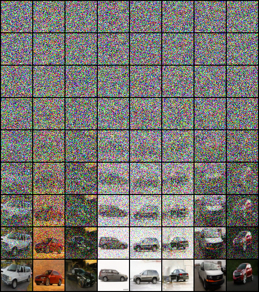

An implementation of DDPM following the original [TensorFlow implementation](https://github.com/hojonathanho/diffusion),
by default it trains on 64x64 Stanford Cars

sample generated images after training 400 epochs:

